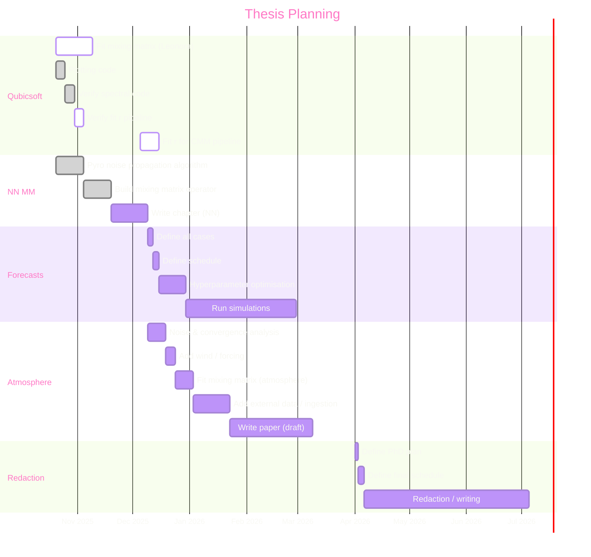

```mermaid
%%{init:{
  "theme":"base",
  "themeVariables":{
    "background":"#282a36",
    "textColor":"#f8f8f2",
    "titleColor":"#ff79c6",
    "primaryColor":"#bd93f9",
    "secondaryColor":"#44475a",
    "lineColor":"#6272a4",
    "noteBkgColor":"#21222c",
    "noteTextColor":"#f8f8f2"
  },
  "gantt": { "barHeight": 24, "barGap": 8 }
}}%%

gantt
  title Thesis Planning
  dateFormat  YYYY-MM-DD
  axisFormat  %b %Y
  todayMarker on

  section Qubicsoft
  Fit mixing matrix (Leonora)         :active, mm,      2025-10-20, 20d
  Plotting code                       :done, plot,      2025-10-20, 5d
  Verify spectral code                :done, spectra,   after plot, 5d
  Verify fit r pipeline               :active, fit,     after spectra, 5d
  Fit r for CMM pipeline              :active, fitCMM,  2025-12-5, 10d

  section NN MM
  Pyro noise propagation algorithm    :done, pyro,      2025-10-20, 15d
  Build mixing matrix operator        :done, cmm,       after pyro, 15d
  Write chapter (NN)                  :chap,            after cmm, 20d

  section Forecasts
  Define all cases                    :case,            after chap, 3d
  Define schedule                     :schedule,        after case, 3d
  Hyperparameter optimisation         :hyper,           after schedule, 15d
  Run simulations                     :simul,           after hyper, 60d

  section Atmosphere
  Noise & convergence analysis        :nac,             after chap, 10d
  Add wind / forcing                  :wind,            after nac, 5d
  Fit mixing matrix (atmosphere)      :atmMM,           after wind, 10d
  Add external data / ingestion       :ext,             after atmMM, 20d
  Write paper (draft)                 :paper,           after ext, 45d

  section Redaction
  Define PhD plan                     :plan,            2026-04-01, 2d
  Define final schedule               :schedulePhD,     after plan, 3d
  Redaction / writing                 :redac,           after schedulePhD, 90d 
```
